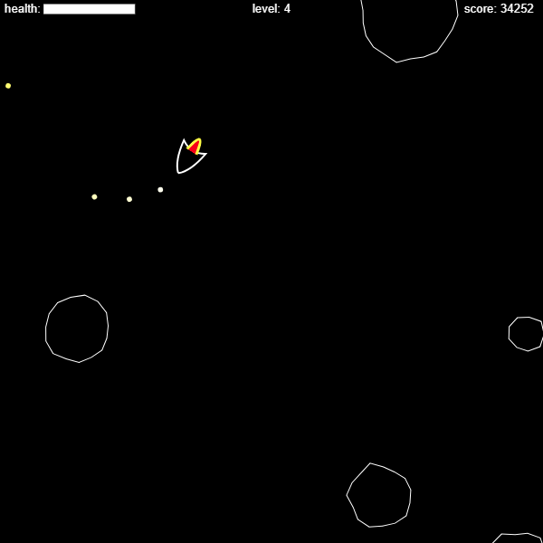

# AsteroidsJS

A basic game of asteroids written in JavaScript using the canvas element. 
All entities have mass and momentum, which are conserved within the universe. Prototype-based inheritance is employed for all masses. 
[Try it here!](https://yzaoui.github.io/AsteroidsJS/asteroids.html)

